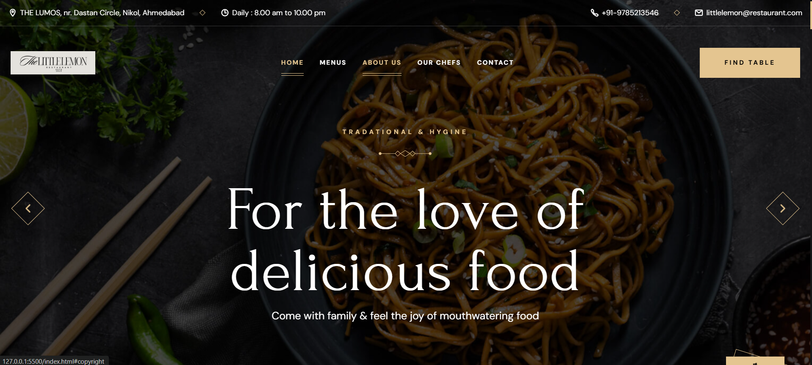
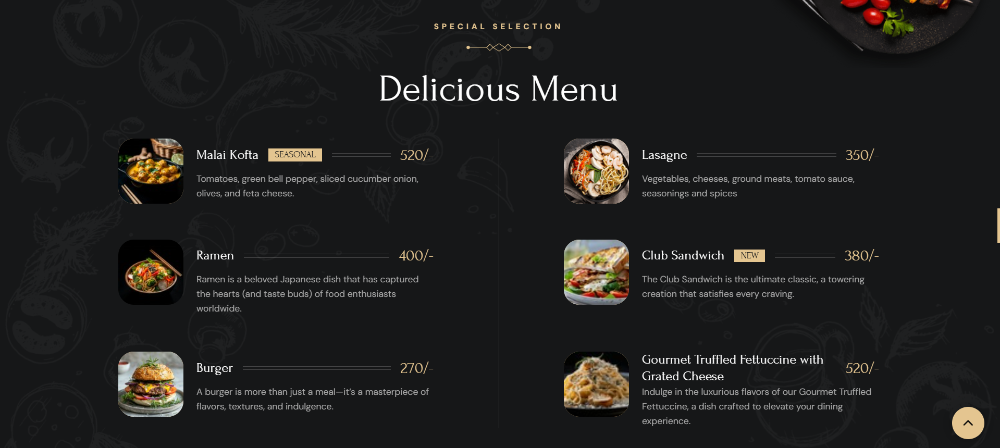
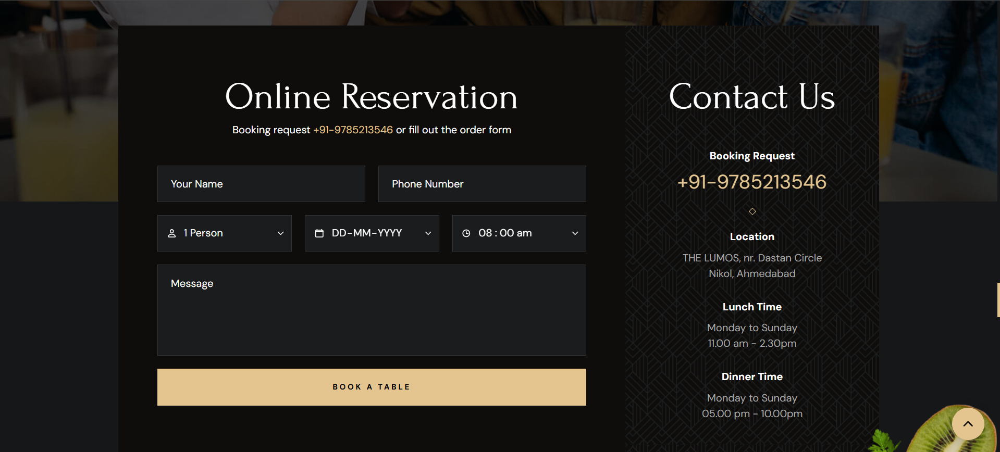

# 🍋 Little Lemon Restaurant Website

Welcome to **Little Lemon**, an elegant one-page restaurant website where you can explore our menus, check upcoming events, and make table reservations online with ease.


---

## ✨ Features

- 📝 **Online Table Reservation**  
  Book your table online directly from the website.

- 📋 **Menu & Prices**  
  View our detailed menu with prices and special items.

- 🎉 **Upcoming Events**  
  Stay updated with upcoming events and celebrations at Little Lemon.

- 🏆 **Our Best Quality Highlights**  
  Discover what makes Little Lemon special through our quality showcase.

- 🏠 **About Us & Ambience**  
  Learn about our story and feel the restaurant's ambience before visiting.

---

## 🚀 Deployment

🔗 **Live Site:** [Visit Little Lemon](your-deployed-link-here) *(add link if deployed on Vercel/Netlify/GitHub Pages)*

---

## 📷 Screenshots
## 📷 Screenshots

| Home Page | Menu Section | Reservation Form | Customer Reviews |
|---|---|---|---|
|  |  |  |  |


*(Replace the image links with your actual uploaded screenshots in a `screenshots` folder.)*

---

## 🛠️ Tech Stack

- HTML5
- CSS3
- JavaScript
- node.js
- mongodb
- postman

---

## 💡 Future Improvements

- Integrate backend for live table bookings
- Add user authentication for reservations
- Responsive redesign for enhanced mobile UX

---

## 📌 Installation

If you want to run it locally:

1. Clone the repository

    ```bash
    git clone https://github.com/rachitrp2211/FULL_STACK_Restaurant_website.git
    ```

2. Open `index.html` in your browser.

---

## 👤 Author

- **Your Name:** Rachit Patel *(replace if using your GitHub username or real name)*  
- **GitHub:** [rachitrp2211](https://github.com/rachitrp2211)

---

## 📄 License

This project is open source and available under the [MIT License](LICENSE).

---

### 🌟 Support

If you like this project, give it a ⭐️ on GitHub to support my work.

---

> **Little Lemon – Where taste meets tradition.**
